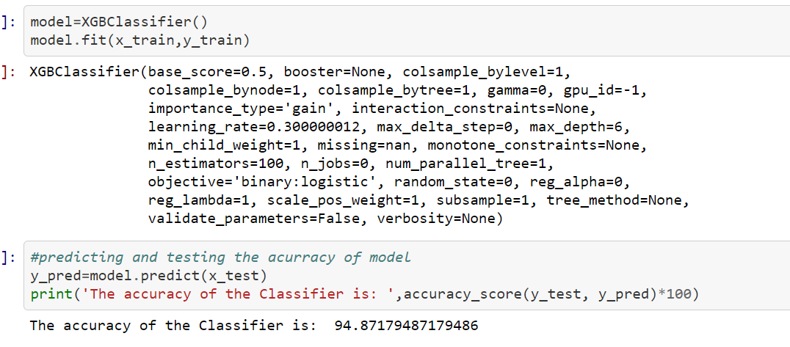

# Parkinsons-disease-detector 
- In this project the problem was to build a Machine Learning model which could accurately detect the Parkinson's disease in patients.
- I have used the Prakinson's data set by University of Oxford

  

## Motivation 
- I wanted to improve my classification skills and wanted to learn XGBoost ( which is a very fast and simple model )

## Attributes
- name - ASCII subject name and recording number
- MDVP:Fo(Hz) - Average vocal fundamental frequency
- MDVP:Fhi(Hz) - Maximum vocal fundamental frequency
- MDVP:Flo(Hz) - Minimum vocal fundamental frequency
- MDVP:Jitter(%),MDVP:Jitter(Abs),MDVP:RAP,MDVP:PPQ,Jitter:DDP - Several measures of variation in fundamental frequency
- MDVP:Shimmer,MDVP:Shimmer(dB),Shimmer:APQ3,Shimmer:APQ5,MDVP:APQ,Shimmer:DDA - Several measures of variation in amplitude
- NHR,HNR - Two measures of ratio of noise to tonal components in the voice
- status - Health status of the subject (one) - Parkinson's, (zero) - healthy
- RPDE,D2 - Two nonlinear dynamical complexity measures
- DFA - Signal fractal scaling exponent
- spread1,spread2,PPE - Three nonlinear measures of fundamental frequency variation

## Approach:
- Cleaned the data, had to normalize the dataset using standardScaler() because the scales were different for each attributes.
- did the preprocessing step using pipline with feature- engine library
- I was able to accurately detect Parkinson's disease 94.8 % of the times using the XGBoost model.

## Result:
  

### Technologies Used:
Python 3.8, Jupyter Notbook, Microsoft Excel

### Requirements:
Scikit-Learn Libraries for python
Feature-Engine Libraries
